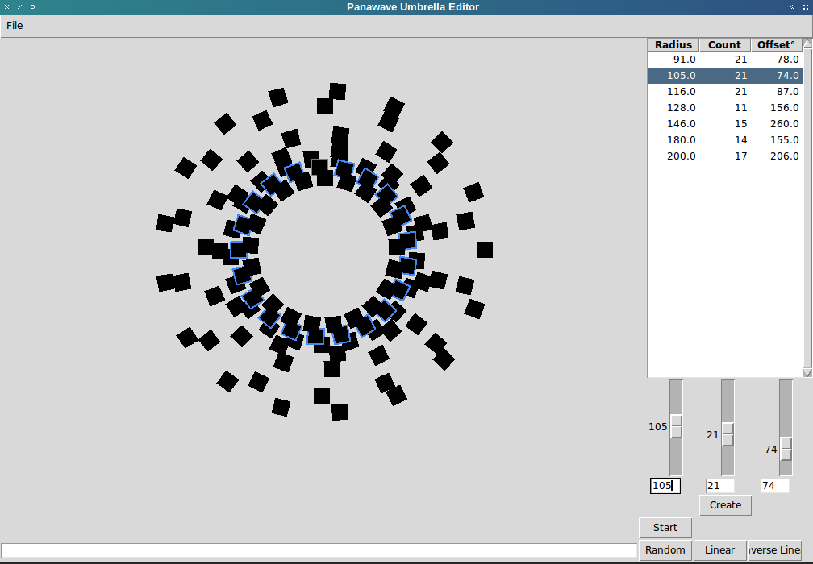

# panawave umbrella generator
The Panawave Umbrella Generator is a (currently) tkinter-based gui tool for generating radial patterns of repeated polygons. These have a variety of uses.

Screenshot of a rather rough development version below:

